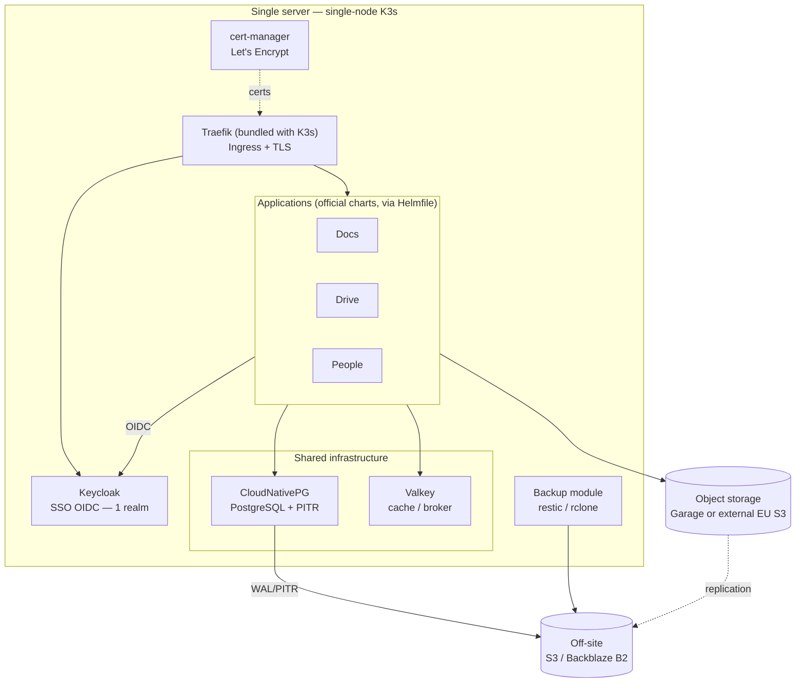

# Architecture — overview

The stack targets **a single server**, without the complexity of a multi-node cluster,
while staying aligned with La Suite's **official** deployment path (Helm).

## Building blocks and choices

| Layer | Component | Role | Replaces / note |
|---|---|---|---|
| Orchestration | **K3s + Helmfile** | Single-node cluster, declarative deploy | Reuses the official Helm charts |
| Reverse proxy / TLS | **Traefik + cert-manager** | Per-subdomain routing, automatic HTTPS | Bundled with K3s |
| SSO | **Keycloak** (1 realm, 1 client/app) | Single sign-on, JIT provisioning | — |
| Database | **CloudNativePG** | PostgreSQL + WAL/PITR backups to S3 | Replaces `bitnami/postgresql` (deprecated) |
| Cache / broker | **Valkey** | Cache and Celery broker | Replaces `bitnami/redis` (deprecated) |
| Object storage | **Garage** *or* **external EU S3** | Drive files, Docs media… | Replaces MinIO (archived) |
| Backups | **CNPG + restic/rclone** | Encrypted off-site backups + tested restore | Missing from existing solutions |
| Host provisioning | **Ansible** | Server bootstrap + K3s install + patches | See [ADR](decisions.md) |

## The principle that makes it "a suite"

Every app points at **the same Keycloak**. The direct consequence: the admin creates
a user **once**, and that person gets SSO access to **all** apps — their per-app
account is created automatically on first login (*JIT provisioning*).

## Optional and out-of-scope apps

- **Mailbox** *(optional, advanced — off by default)*: La Suite's own mail app
  ([suitenumerique/messages](https://github.com/suitenumerique/messages)), federated to the
  same Keycloak. Mail is the hardest part to make reliable (deliverability, port 25, rDNS),
  so it ships isolated and disabled by default. See the [Mailbox application](messages.md).
- **Meet (video)** *(out of scope)*: LiveKit + coturn require direct UDP and a lot of
  CPU/bandwidth, painful on a single server. Deferred.

The full rationale and the rejected alternatives are in the
[architecture decisions](decisions.md).
