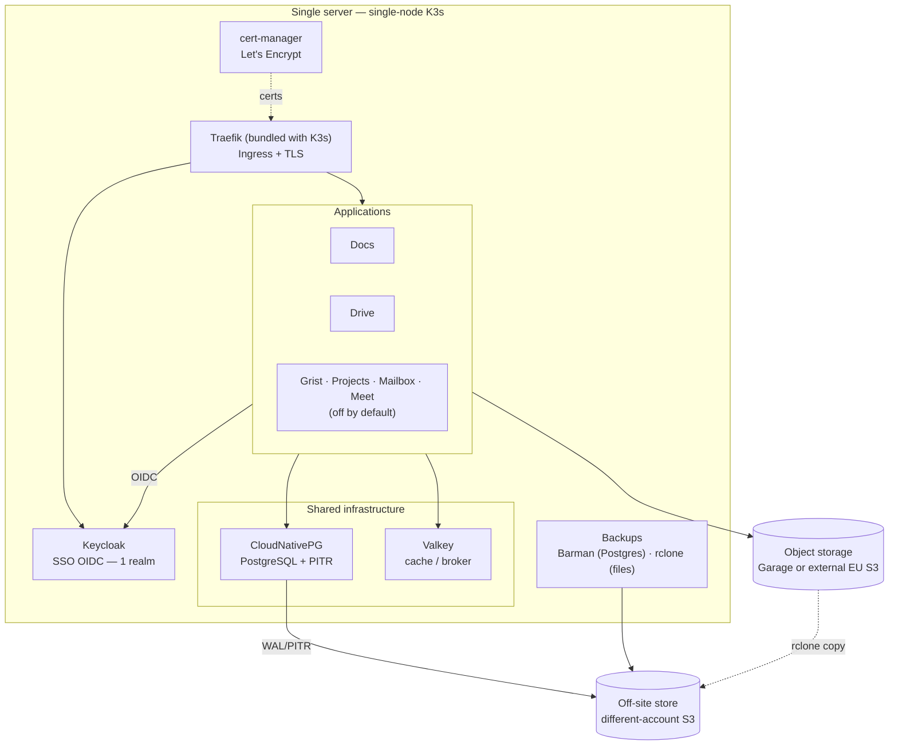

# How it works

Everything runs on **one server**. You don't need to be a Kubernetes expert to run it —
`suite.yaml` and the `suite` commands do the heavy lifting — but here's the picture of
what's inside, so nothing feels like a black box.

At the centre is **single sign-on**: every app trusts the same login, so a person you add
once can open all of them. Around it sit the shared pieces every app needs — a database, a
cache, file storage — plus automatic HTTPS and off-site backups.

## The building blocks

| Piece | What it does |
|---|---|
| **K3s + Helmfile** | Runs everything on one machine from a single declarative config |
| **Traefik + cert-manager** | Routes each app to its own subdomain and keeps HTTPS certificates fresh, automatically |
| **Keycloak** | The single sign-on everyone logs in through |
| **CloudNativePG** | The PostgreSQL database, with point-in-time backups |
| **Valkey** | A small cache the apps rely on |
| **Garage** *or* **external S3** | Where files and media live — self-hosted or a European cloud provider |
| **Backups** | Encrypted copies kept off-site, with a restore that's regularly tested |
| **Ansible** | Sets the server up in the first place |

## What makes it "a suite"

Every app trusts **the same login**. So you add a person **once**, and they get access to
**all** the apps — their account in each one is created automatically the first time they
sign in. No per-app setup, no separate passwords.

## Apps that need extra setup

- **Mailbox** *(off by default)*: La Suite's own mail app
  ([suitenumerique/messages](https://github.com/suitenumerique/messages)), federated to the
  same Keycloak. Mail is the hardest part to make reliable (deliverability, port 25, rDNS),
  so it ships isolated and disabled by default. See the [Mailbox application](messages.md).
- **Meet** *(off by default)*: video conferencing
  ([suitenumerique/meet](https://github.com/suitenumerique/meet)) powered by LiveKit,
  federated to the same Keycloak. It is the only app needing non-HTTP ports — LiveKit
  media on `7882/udp` (mux) + `7881/tcp` (fallback), opened via the `enable_meet`
  Terraform/Ansible flag. Real-time media is CPU/bandwidth-heavy, so it fits modest
  concurrency on a single server. See the [Meet application](meet.md).
